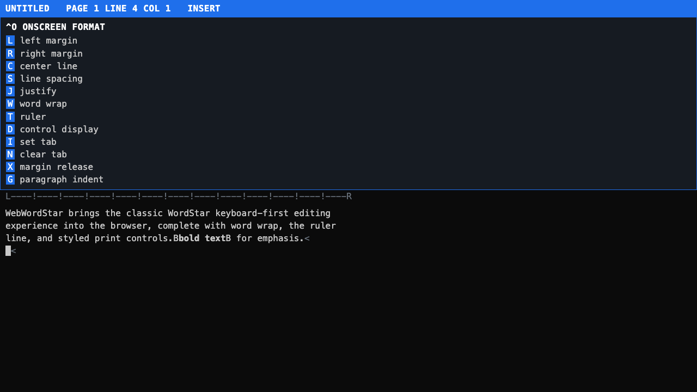

# WebWordStar

A clean-room, browser-based reimplementation of **WordStar** for the modern era —
faithful to the original keyboard-first interface (the diamond cursor, `^K` block
commands, `^Q` quick commands), extended with always-saved documents and, soon,
real-time multiuser collaboration over WebSockets.



## Philosophy

These interfaces were already correct. WordStar's keyboard-driven design let writers
keep their hands on the keys and their attention on the words, and decades of muscle
memory proved how well it worked. We're not replacing that design — we're bringing it
forward, running natively in the browser.

## Status

**Early but usable.** Working toward the v1.0.0 milestone. Shipped so far: the editor
core (diamond, `^Q`, `^K` block commands, arrow-key alternates, editing), the editor
core remainder — word wrap and `^B` reflow, a ruler line and flag column, the full
`^O` onscreen-format menu, `^P` print controls with styled rendering, self-revealing
menus, help levels, and multi-level undo/redo — plus always-saved persistence. Still
to come in v1.0.0: layout dot commands, print/export, and real-time collaboration.
See the roadmap in [`CLAUDE.md`](CLAUDE.md) and the [`CHANGELOG.md`](CHANGELOG.md).

## Running it

```bash
npm install
npm run dev        # Vite on http://localhost:5273 + the WebSocket server on :5274
```

Open **http://localhost:5273** — you'll be redirected to a document URL like
`http://localhost:5273/?doc=<uuid>`. That UUID is the document's identity: bookmark or
share the URL to return to the same document; open a fresh URL for a new one. Everything
you type is **saved automatically** — there is no save command.

```bash
npm test               # Vitest unit + integration
npx playwright test    # Playwright end-to-end (browser)
npm run build          # type-check + Vite production build
```

## Keyboard reference

WebWordStar binds commands to `Ctrl`+letter, exactly like WordStar. On non-QWERTY
layouts a few keys are physically displaced (e.g. `^A`/`^Q` on AZERTY); arrow keys are
provided as a modern alternative for cursor movement.

### The diamond (cursor movement)

| Keys | Move | Alternate |
|---|---|---|
| `^E` / `^X` | Up / down a line | `↑` / `↓` |
| `^S` / `^D` | Left / right a character | `←` / `→` |
| `^A` / `^F` | Left / right a word | |

### `^Q` quick movement

| Keys | To |
|---|---|
| `^Q S` / `^Q D` | Start / end of line |
| `^Q E` / `^Q X` | Top / bottom of screen |
| `^Q R` / `^Q C` | Start / end of document |

### `^K` block & document commands

| Keys | Action |
|---|---|
| `^K B` / `^K K` | Mark block begin / end (highlighted) |
| `^K C` | Copy the marked block to the cursor |
| `^K Y` | Delete the marked block |
| `^K H` | Hide / show the block highlight |
| `^K N` | Name the document (inline `DOCUMENT NAME:` prompt) |

### Editing

| Keys | Action |
|---|---|
| `^V` | Toggle insert / overtype |
| `Enter` | Split the line |
| `Backspace` / `^G` | Delete left / right (joins lines at edges) |
| `^B` | Reflow (word-wrap) the current paragraph |
| `^U` | Undo |
| `^Q U` | Redo |
| `^K V` | Move the marked block to the cursor |

### `^O` onscreen format

| Keys | Action |
|---|---|
| `^O L` / `^O R` | Set left / right margin (prompt) |
| `^O C` | Center the current line |
| `^O S` | Set line spacing (prompt) |
| `^O J` | Toggle justification |
| `^O W` | Toggle word wrap |
| `^O T` | Toggle the ruler line |
| `^O D` | Toggle print-control display |
| `^O I` / `^O N` | Set / clear a tab stop |
| `^O X` | Release margins |
| `^O G` | Temporary paragraph indent |

### `^P` print controls

| Keys | Style |
|---|---|
| `^P B` | Bold |
| `^P S` | Underline |
| `^P Y` | Italic |
| `^P D` | Double-strike |
| `^P X` | Strikeout |
| `^P T` | Superscript |
| `^P V` | Subscript |
| `^P O` | Non-break space |

### `^J` help

| Keys | Action |
|---|---|
| `^J H` | Cycle help level (0–3, default 3) |

## Architecture

- **Browser** — a pure keystroke reducer (`src/editor/state.ts`) over a pure document
  model (`src/shared/document.ts`), an HTML renderer (`src/editor/render.ts`), and a
  `WsClient` (`src/ws/WsClient.ts`) that streams changes to the server.
- **Server** — Node + WebSocket (`server/index.ts`) with a `DocumentSession` per
  connection over a SQLite `DocumentStore` (`better-sqlite3`, WAL).
- **Shared** — TypeScript types and the document model are shared between client and server.

See `CLAUDE.md` for the full architecture, command tables, and roadmap.

## Tech stack

Node.js · WebSockets (`ws`) · SQLite (`better-sqlite3`) · TypeScript · Vite · Vitest · Playwright.

## Related

Built by the same author as [WebBaseIII](https://github.com/DDecoene/WebBaseIII),
a dBASE III clone that runs in the browser. WebWordStar continues the same idea:
bring forward the interfaces that were already right.
